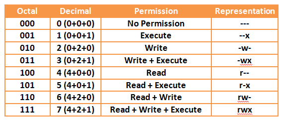

# chmod

## Introduction

#### Droit d'accès

Les droits d'accès définissent la possession d'un fichier ou d'un répertoire à un utilisateur et à un groupe d'utilisateurs. Ils gèrent aussi quelles actions les utilisateurs ont le droit d'effectuer sur les fichiers (lecture, écriture et exécution), selon qu'ils sont propriétaire du fichier, membre du groupe propriétaire du fichier ou ni l'un ni l'autre. La possession et la gestion des permissions associées s'effectue individuellement avec chaque fichier.


Il est à noter que seuls le propriétaire du fichier ainsi que le super-utilisateur ont la possibilité de modifier les permissions sur un fichier. (Un membre du groupe propriétaire ne peut pas changer les permissions sur un fichier.) Quand l'utilisateur actuel n'est pas le propriétaire actuel du fichier, il sera nécessaire de faire précéder la commande par `sudo`, puisqu'elle devra être effectuée avec les droits d'administration.


#### Afficher les droits d'un fichier

&#x20;Les droits des fichiers d'un répertoire peuvent être affichés par la commande `ls -l`et apparaissent alors comme une liste de 10 symboles. :

.png>)

&#x20;**Le premier symbole **peut être « - », « d », soit « l », entres autres. Il indique la nature du fichier :

* &#x20;**-** : fichier classique
* &#x20;**d** : répertoire
* &#x20;**l** : lien symbolique
* &#x20;**c** : périphérique de type caractère
* &#x20;**b** : périphérique de type bloc
* &#x20;**p** : pipe (FIFO) "tube" ou "tuyau" en anglais ou pipeline aussi en français
* &#x20;**s** : socket

Suivent ensuite 3 groupes de 3 symboles chacun, indiquant si le fichier (ou répertoire) est autorisé en lecture, écriture ou exécution.&#x20;

.png>)

Les 3 groupes correspondent, dans cet ordre, aux droits du propriétaire, du groupe puis du reste des utilisateurs. Dans le paragraphe introductif, vous aurez remarqué des lettres en gras dans les termes anglais. Ce sont ces lettres qui sont utilisées pour symboliser lesdites permissions. Si la permission n'est pas accordée, la lettre en question est remplacé par « - ». Si l'on reprend les lettres données pour lecture/écriture/exécution (**r**ead/**w**rite/e**x**ecute), nous obtenons : **rwx**.

## Syntaxe

```bash
chmod <right> <file>
```

### Options



###

| Paramètre | Description |
| --------- | ----------- |
| -R        | récursif    |

##

## Utilisation

```bash
chmod u+rwx,g+rx-w,o+r-wx fichier3
```

* On modifie les droits de tous les groupes sur le fichier `fichier3`&#x20;
* On ajoute la permission de lecture, d'écriture et d'exécution pour le **propriétaire** ;
* &#x20;On ajoute la permission de lecture et d'exécution au **groupe propriétaire**, et on retire la permission d'écriture ;
* &#x20;On ajoute la permission de lecture aux **autres**, et on retire la permission d'écriture et d'exécution.

```
chmod 754 fichier3
```

même commande que précédemment

